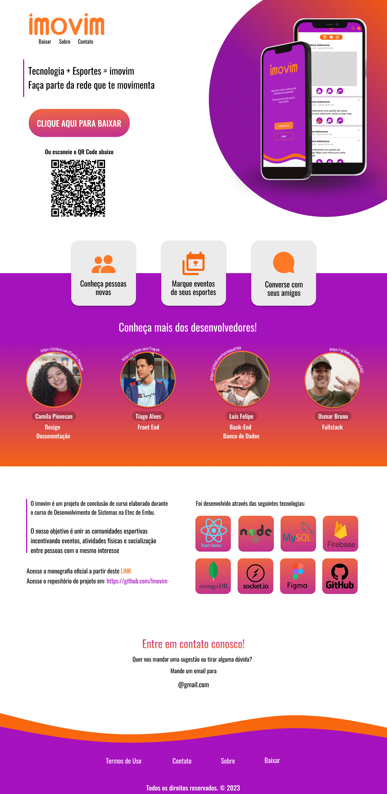

<h1 align="center"> Imovim Landing Page</h1>

  Página de apresentação para o trabalho de conclusão do curso de Desenvolvimento de Sistemas.  

  Acesse a página: 
  <a href="https://imovim-landing-page.vercel.app/">https://imovim-landing-page.vercel.app</a>

  

 

  

## 💻 Projeto

Imovim é um projeto voltada ao ambiente esportivo, que tem como principal objetivo unir a comunidade do esporte e incentivar a volta ou o início de práticas físicas e através da interface permitir o compartilhamento de experiências entre os usuários, além de possibilitar o agendamento de eventos com finalidade social. 

## 🧵 Layout

Você pode visualizar a prototipagem do projeto através [DESSE LINK](https://www.figma.com/file/XcLGwNRW1qLCBhAM4YmJUL/IMOVIM?node-id=591%3A36&t=cTYHbDcIFRCt9NyC-1). É necessário ter conta no [Figma](https://figma.com) para acessá-lo.

## 🧾 Licença

Esse projeto está sob a licença MIT.

---
